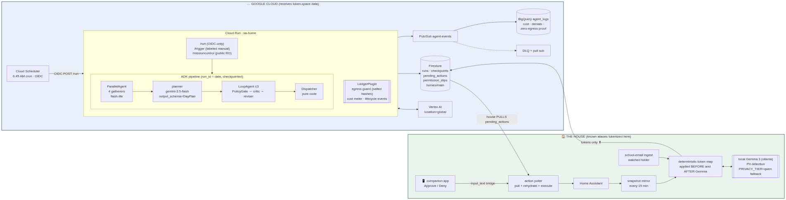

# 🫀 hearthbeat

**An autonomous household-operations agent with no chat UI.** Every morning at
6:45, Cloud Scheduler fires it. It reads a token-scrubbed mirror of a real
family home — Home Assistant state, the family calendar, the school-email
inbox — plans the day, argues with itself about the plan until a deterministic
policy engine is satisfied, asks a human for a permission slip before anything
personal, and then **the house pulls its actions from the cloud**. Nobody
types a prompt. The family just notices the morning got easier.

Built for the All Things Agentic Hackathon (category: **The Taskmaster**) with
Google ADK, Gemini 3.5 on Vertex AI, and Cloud Run / Cloud Scheduler /
Pub/Sub / Firestore / BigQuery — plus a load-bearing **local Gemma 3** privacy
tier running inside the house.

---

## Judges: run the whole thing in 90 seconds

Requires only Docker (no Google account, no credentials, no house):

```bash
git clone https://github.com/DZim89/hearthbeat.git
cd hearthbeat
SIMULATED_HOME=1 docker compose up
```

Then open **http://localhost:8080/missioncontrol** and watch a full run:

1. The house mirrors a (fixture) home into the Firestore **emulator** and the
   school email is ingested through the double-scrub privacy gateway.
2. The kickoff container fires the pipeline — honestly labeled
   `trigger_source: manual`; only the real Cloud Scheduler's OIDC identity can
   ever produce `scheduled` (that's a feature, see [Run integrity](#run-integrity)).
3. Gatherers → planner → policy loop → dispatcher run; a **planted forbidden
   action** (`front_door_unlock`, red team) is refused and written as a denial
   row; real actions land in `pending_actions`.
4. The (fixture) house pulls them: the kid TV pauses in the `ha-sim` log, the
   calendar-conflict fix is written, and the "message Grandma" action stops at
   a **permission slip** (auto-approved after 30 s in judge mode, labeled
   `judge_auto`).

The hosted, live-against-the-real-house instance is here:
**https://hearthbeat-369944070051.us-central1.run.app/missioncontrol**
*(read-only; it shows whatever this morning's real run did — in token space,
because real names never reach the cloud at all).*

---

## Why "no chat" is the point

Chat agents wait to be asked. A household doesn't need another thing to
operate — it needs an **operations layer**: something that notices the
permission slip due tomorrow, the calendar collision at 5:30, the cartoons
still playing on a school morning — and acts, within hard limits, with a human
signature required exactly where a reasonable family would require one.

hearthbeat's interfaces are: a cron, a read-only status page, a morning
briefing that lands on a phone, an Approve/Deny notification, and things
quietly happening in the house.

## Architecture



Full write-up with the mermaid source: [docs/ARCHITECTURE.md](docs/ARCHITECTURE.md).

The ADK composition (`app/agent.py`):

```
SequentialAgent
├── ParallelAgent "gatherers"        4× LlmAgent (gemini-3.5-flash-lite) with
│                                    function tools over the Firestore mirror
├── LlmAgent      "planner"          gemini-3.5-flash @ location=global,
│                                    output_schema=DayPlan (structured output)
├── LoopAgent     "policy_loop"      PolicyGate (custom BaseAgent, pure code,
│   (max_iterations=3)               escalates only on: zero findings AND a
│                                    critique that passes AND hash-matches the
│                                    exact plan revision) → critic → reviser
└── Dispatcher                       custom BaseAgent, no model — writes
                                     content-hashed action docs via create()
```

Observability is one ADK **plugin** (`app/ledger.py`): every lifecycle hook
emits to Pub/Sub `agent-events` → a **native BigQuery subscription** (with a
DLQ) → `agent_logs` views for cost-per-run in cents, policy denials, and the
zero-egress proof. The same hook is the **egress guard** (below).

## The privacy architecture

Real names live only inside the house. Three independent layers:

| Layer | Where | What it does |
|---|---|---|
| Deterministic token map | house | `Riley → [[P_KID1]]`, applied **before and after** the model pass; `assert_clean` hard-fails on any survivor. The real map is gitignored — this repo ships a fixture family. |
| **Local Gemma 3** (ollama) | house | Catches PII the family map cannot know — a teacher's name and phone number in a school email. Falls back to a local qwen server (`PRIVACY_TIER=qwen`) and the ledger records which tier did each pass. |
| Salted-hash egress guard | cloud | `before_model_callback` scans every outbound Vertex request against salted SHA-256 hashes of the protected names. The cloud proves nothing leaked **without ever holding a name in plaintext**. A match blocks the model call and fails the run. |

Standing proof in BigQuery:

```sql
SELECT * FROM `new-prompt-490003.agent_logs.egress_violations_v`;  -- 0 rows
SELECT * FROM `new-prompt-490003.agent_logs.privacy_tier_v`;       -- Gemma's catches
```

## Run integrity

We think demo honesty is an architectural property, not an editing choice:

- `trigger_source=scheduled` is writable from **one code path**: `POST /run`,
  which verifies the caller's OIDC identity is the scheduler service account.
- `POST /trigger` (filming, judge mode) hard-codes `manual`. The badge is on
  Mission Control, the run doc, and every BigQuery row.
- `run_id = date` with a Firestore `create()` precondition: re-fired crons
  no-op or resume from stage checkpoints; content-hashed action docs make
  double-dispatch structurally impossible (kill the service mid-run and
  re-fire it — we did, on camera).

## The action path (pull, never push)

The house exposes **no inbound surface** — no webhook, no tunnel. A poller
claims approved actions from Firestore by transaction, **rehydrates the tokens
locally**, re-validates against the same `config/policy.yaml` (the third
enforcement of the same default-deny whitelist), and executes in Home
Assistant. Anything targeting a person stops at a `permission_slip` until a
human taps Approve on an HA companion-app notification — human approval also
lifts quiet-hours for that action, because a tap is consent.

## Required tech, mapped

- **Gemini 3.5** — `gemini-3.5-flash` (planner/critic) and
  `gemini-3.5-flash-lite` (gatherers) via **Vertex AI**, `location=global`.
- **Google ADK** — `SequentialAgent`, `ParallelAgent`, `LoopAgent`, custom
  `BaseAgent`s (PolicyGate/Dispatcher), `output_schema` structured outputs,
  a `BasePlugin` for lifecycle observability, `LiteLlm` for the house-side
  Gemma agent (exported as an `AgentTool`).
- **Google Cloud** — Cloud Run (service, runs as `sa-home`), Cloud Scheduler
  (OIDC-authenticated cron), Pub/Sub (+ DLQ, native BigQuery subscription),
  Firestore (runs/checkpoints/actions/slips + the house mirror), BigQuery
  (the ledger + views).
- **Bonus: local Gemma** — gemma3 via ollama, load-bearing in every
  school-email ingest (see `privacy_tier_v`).

## Production setup (the real house)

```bash
uv sync --all-groups                      # deps
bash infra/setup.sh apis                  # enable APIs, Firestore DB, BQ table,
                                          # Pub/Sub DLQ + BigQuery subscription, IAM
gcloud run deploy hearthbeat --source . --region us-central1 \
  --service-account sa-home@<project>.iam.gserviceaccount.com \
  --allow-unauthenticated --env-vars-file <your env.yaml>
bash infra/setup.sh scheduler https://<service-url>   # the 6:45 AM cron
bash infra/setup.sh selftest              # prove an event lands in BigQuery
bq query --use_legacy_sql=false < infra/bq_views.sql

# house side (WSL/Linux box inside the home):
python -m house.export_egress_hashes      # -> paste into the Cloud Run env
python -m house.run_all                   # mirror + email ingest + action poller
```

Home Assistant needs two 30-second additive pieces: a **Local Calendar**
(`calendar.hearthbeat_family`) and the approval bridge in
[docs/ha_automation.yaml](docs/ha_automation.yaml). Both are trivially
removable; nothing existing is modified.

## Repo tour

```
app/        the cloud pipeline (ADK composition, policy engine, ledger, server)
house/      everything inside the home (scrub, Gemma gateway, mirror, poller, ha-sim)
config/     policy.yaml (the action whitelist), prices.yaml; the REAL token map
            lives here on the house machine only — gitignored
fixtures/   the invented demo family + recorded LLM responses for judge mode
infra/      idempotent gcloud setup, BQ views, canary, judge kickoff
tests/      the scrub round-trip and policy table tests (the graded core)
docs/       architecture, demo runbook, the HA automation
```

## Honesty ledger (disclosures)

- **Judge-mode substitutions**: Firestore runs as the official **emulator**
  (real wire protocol, real transactions). BigQuery/PubSub become a JSONL file
  (no free BQ emulator exists; the emission code is identical). Gemini
  responses replay from recordings made during real runs (`JUDGE_LLM=live`
  uses your `GEMINI_API_KEY` instead). Gemma's findings for the fixture email
  are the recorded spans from the real house run.
- **The calendar conflict in the demo video was seeded** (soccer practice vs.
  dinner at Grandma's) so the story is legible on camera. The detection,
  planning, refusal, approval, and calendar write are all real and live.
- **AI assistance**: this project was built with Claude Code (Anthropic) as
  the coding agent, driven by the maintainer. The pre-existing Home Assistant
  installation and local model servers (ollama/vLLM) are environment/data
  sources, not part of this submission's codebase.
- **Test/demo runs** use suffixed run ids (`YYYY-MM-DD-e2eN`) and
  `trigger_source=manual` — the scheduled-run footage is a real cron firing.

## Cost

A full run is **~1.7¢** (BigQuery-audited, `runs_v.cost_cents`). The policy
engine enforces a 50¢/day budget ceiling mid-run — the agent literally refuses
its own plan if it would blow the budget.
