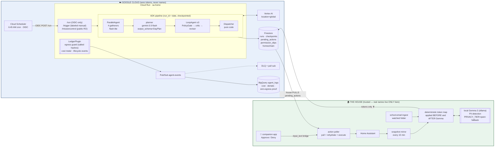

# hearthbeat — architecture

An autonomous household-operations agent with **no chat UI**. A Cloud Scheduler
cron fires it; it reads a token-scrubbed mirror of a real family home, plans
the day, argues with itself about the plan, asks a human for permission where
it matters, and the house **pulls** its actions — the cloud has no path in.

## The five design commitments

**1. Autonomy without a mouth.** There is no chat. The entrypoint is a cron.
The product's only "UI" is the read-only Mission Control page, a morning
briefing that lands on a phone, and things quietly happening in the house.

**2. Default-deny, enforced three times.** `config/policy.yaml` is the only
authority on what the agent may do. The same pure-code check runs (a) inside
the LoopAgent as PolicyGate — driving the critic/reviser loop with a
plan-hash-bound critique so a stale "pass" can never green-light a newer plan;
(b) in the Dispatcher before anything touches Firestore; (c) in the house
poller before anything touches Home Assistant. A planted forbidden action
(`front_door_unlock`) is refused at layer (a) and lands as a denial row in
BigQuery — we film that.

**3. The cloud never learns a name.** House-side, a deterministic token map is
applied before AND after a local Gemma pass (`deep_scrub`): the map catches the
family (the thing it knows), Gemma catches strangers' PII the map cannot know
(a teacher's name in a school email), and `assert_clean` hard-fails if either
missed. Cloud-side, the LedgerPlugin's `before_model_callback` scans every
outbound model request against **salted hashes** of the protected names — the
cloud can prove nothing leaked without ever holding plaintext. BigQuery view
`egress_violations_v` shows zero protected-alias matches for every legitimate
run (its only historical rows are the guard blocking our own build mistake —
kept deliberately).

**4. Pull, never push.** The house exposes no webhook, no tunnel, no inbound
socket. Actions flow: Dispatcher → Firestore `pending_actions` → poller claims
by transaction → rehydrates tokens locally → executes in HA. Sensitive actions
(messaging a person) stop in `permission_slips` until a human taps Approve on
an HA companion-app notification (or the console standby). Human approval is
consent — it also lifts quiet-hours for that action.

**5. A manual run can never impersonate the cron.** `trigger_source=scheduled`
is writable from exactly one code path: `/run`, behind in-app OIDC verification
that the caller is the scheduler's service account. `/trigger` hard-codes
`manual`. The badge on Mission Control, the run doc, and every ledger row
carry it. Judge mode fires `/trigger` — and says so.

## Durability

`runs/{YYYY-MM-DD}` is claimed with a Firestore `create()` precondition —
re-fired crons no-op (done), 409 (fresh heartbeat), or transactionally take
over (stale). Each of the four stages checkpoints its state slice; a resumed
run rebuilds the ADK tree from only the unfinished stages and seeds session
state from the checkpoints. Action docs are content-hashed and `create()`d:
re-dispatch is idempotent under the tested retry paths (mid-run kill + re-fire).

## Judge mode

`SIMULATED_HOME=1 docker compose up` from a clean clone, zero Google
credentials: the real agent image + the real Firestore **emulator** (real wire
protocol — the transactions and preconditions above actually execute), a fake
HA seeded from fixtures, the three house processes, recorded Gemini responses
(`FixtureLlm`), and a kickoff that fires `/trigger`. Substitutions happen at
the narrowest seam that has no free emulator (BigQuery → JSONL ledger file,
Gemma → recorded findings), and each one is disclosed in the README.
